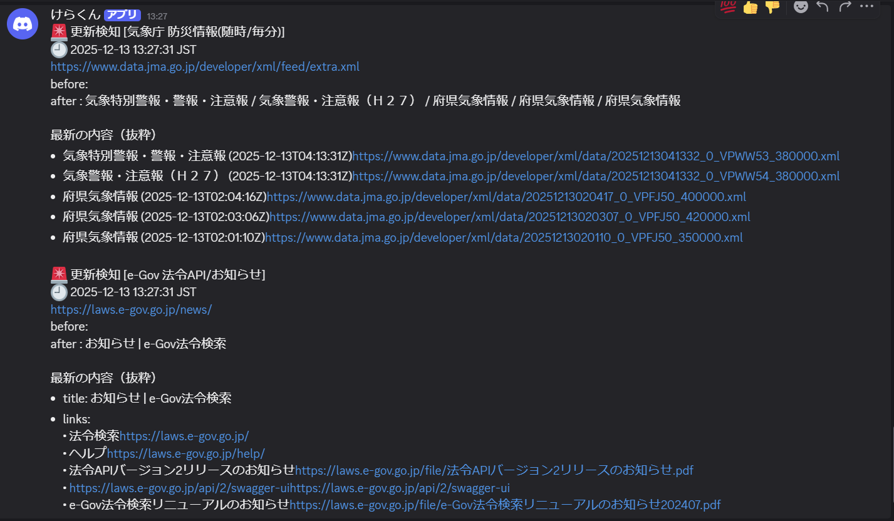

# Page Monitor (GitHub Actions + Discord)
🇯🇵 日本語 / 🇺🇸 English

- [日本語](#日本語)
- [English](#english)
## 日本語
（日本語の説明）

## English
(English description)

Webページ / Atom(XML)の更新を監視して、変化があればDiscordに通知します。

## Demo

## Setup
1. GitHub Secrets に DISCORD_WEBHOOK_URL を登録
2. Actions から Run workflow を実行

## targets.csv
監視対象は targets.csv に追加します。
